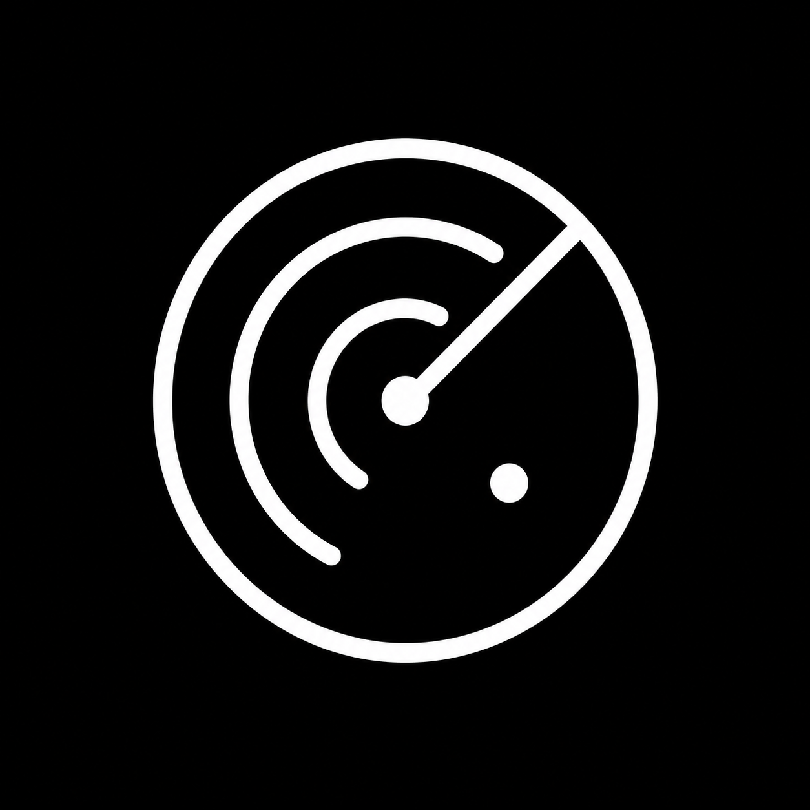
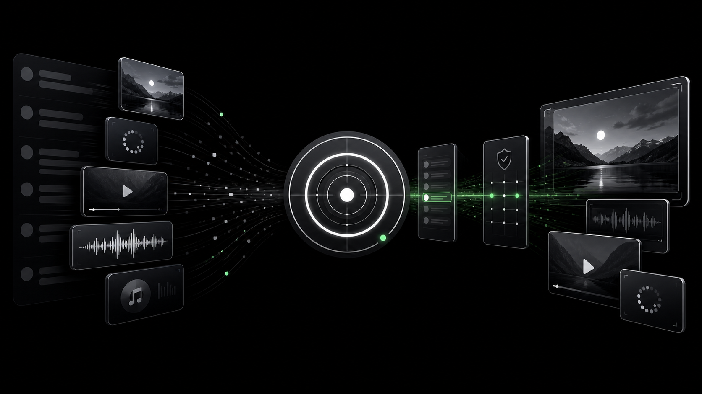
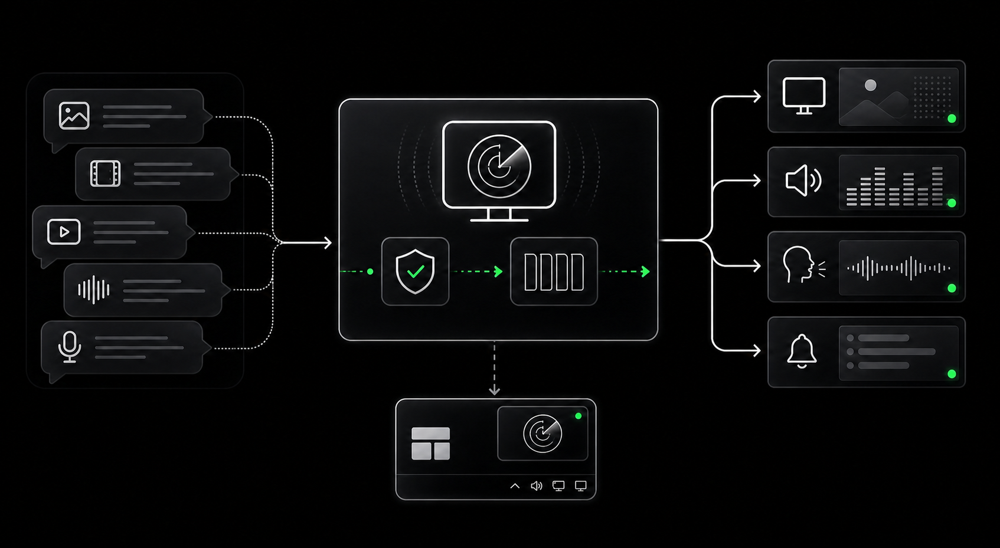

<p align="center">
  
</p>

<h1 align="center">Relay</h1>

<p align="center">
  <strong>Turn Discord media into polished OBS overlays — locally, privately, and in real time.</strong>
</p>

<p align="center">
  Relay receives images, GIFs, videos, audio, and TTS messages from Discord,<br />
  then routes them to dedicated OBS Browser Sources and optional Windows widgets.
</p>

<p align="center">
  
  
  
  
  
</p>

<p align="center">
  <a href="#quick-start">Quick start</a> ·
  <a href="#what-relay-does">Features</a> ·
  <a href="#obs-browser-sources">OBS sources</a> ·
  <a href="#privacy-by-design">Security</a> ·
  <a href="USAGE.md">User guide</a>
</p>

<p align="center">
  
</p>

## One channel in. Every output ready.

Relay is a Windows desktop application that connects a Discord bot to OBS Studio. Community media enters a controlled local pipeline, reaches the correct output in FIFO order, and disappears cleanly when playback is complete.

There is no hosted Relay account, cloud dashboard, telemetry service, or remote media processor. The server listens on `127.0.0.1`, credentials are protected by Windows, and your OBS source URLs stay private on the same computer.

<table>
  <tr>
    <td width="33%" valign="top">
      <strong>Built for live use</strong><br />
      Separate visual, audio, TTS, and notification outputs keep OBS scenes flexible and easy to mix.
    </td>
    <td width="33%" valign="top">
      <strong>Safe by default</strong><br />
      Optional manual moderation, type filters, bounded queues, and one-click skip protect the broadcast.
    </td>
    <td width="33%" valign="top">
      <strong>Local by design</strong><br />
      The control panel, widgets, WebSocket hub, media cache, and browser sources run on your Windows PC.
    </td>
  </tr>
</table>

## How Relay moves media

<p align="center">
  
</p>

```text
Discord media channel
        │
        ▼
Relay bot ──► optional moderation ──► bounded FIFO queues
                                            │
                     ┌──────────────────────┼──────────────────────┐
                     ▼                      ▼                      ▼
                 /medias                /audios                 /tts
                     │                      │                      │
                     └──────────────► /notifications ◄────────────┘
                                            │
                                  OBS + Windows widgets
```

## What Relay does

| Area | Capability |
|---|---|
| Visual media | Images, animated GIFs, Discord GIF-picker embeds, MP4/WebM video, transparent idle canvas, native aspect ratios, and fade transitions |
| Timing | Independent 1–60 second timers for static images, GIFs, stickers, and silent TTS notifications; normal videos play to completion |
| Stickers | Discord PNG, APNG, GIF, and Lottie stickers on a dedicated OBS source with its own FIFO queue |
| Audio | Common audio formats, original cached bytes, embedded album artwork, title and artist metadata, and a “Now playing” card |
| Text-to-speech | Dedicated Discord channel, Windows voices, French/English detection, character limit, queue capacity, skip, and clear |
| Notifications | Independent OBS notification source, optional custom sound, and a movable Windows notification widget |
| Moderation | Optional local approval queue with independent image/GIF, video, and audio filters |
| History | Last 50 media items in memory with replay and clear controls |
| Queueing | Multi-user FIFO handling with watchdog recovery instead of silent stalls or dropped bursts |
| Widgets | Transparent, always-on-top, movable and resizable windows with persistent geometry, locking, and optional 16:9 media sizing |
| Output layout | Independent 50–200% content scale and 0–40% crop controls for media and notifications in OBS and Windows widgets |
| Personalization | Light and OLED-dark themes, five design directions, local interface fonts, RGB accent color, text scale, three sidebar layouts, configurable Discord bot presence, and 12 regional interface locales |
| Control | System tray panel, live status, overlay count, nine default `/relay` commands with individual switches, up to 16 local custom commands backed by predefined Discord actions, and global `Ctrl+Alt+S` skip shortcut |

## Quick start

### 1. Install Relay

Download the latest `Relay_x.x.x_x64-setup.exe` from the repository releases and run the per-user installer. Administrator rights are not required.

A portable `Relay_x.x.x_x64-portable.exe` is also attached to each release: it runs without installation and stores its configuration in the same per-user location as the installed version.

### 2. Create the Discord bot

1. Open the [Discord Developer Portal](https://discord.com/developers/applications).
2. Create an application and add a bot.
3. Enable **Message Content Intent** under **Privileged Gateway Intents**.
4. Copy the **Application ID** and **Bot Token** into Relay.
5. Use Relay’s generated invitation URL to add the bot to your server.

The bot needs **View Channel** and **Read Message History** in every configured channel. Private channels work when Relay or its role is explicitly granted access.

### 3. Route Discord channels

- Select one channel for images, GIFs, videos, and audio.
- Optionally select a separate channel for TTS messages.
- Save the routing; changes apply without restarting Relay.

### 4. Add the OBS sources

Open Relay’s **Overlay** page, copy each private URL, and add it as a separate OBS Browser Source. Keep Relay running while OBS is using the sources.

### 5. Go live

Post a supported media item in the watched channel. With moderation disabled it enters the output queue immediately; with moderation enabled it waits for local approval inside Relay.

For the full setup, recommended OBS dimensions, TTS configuration, widgets, and troubleshooting, read the **[Relay user guide](USAGE.md)**.

## OBS Browser Sources

Relay keeps different media classes independent so each source can be positioned and mixed separately.

| Source | Local route | Purpose |
|---|---|---|
| Visual media | `http://127.0.0.1:4590/medias` | Images, GIFs, and videos with author overlay |
| Audio | `http://127.0.0.1:4590/audios` | Music, soundboard clips, and Discord audio attachments |
| TTS | `http://127.0.0.1:4590/tts` | Synthesized speech as a dedicated audio source |
| Notifications | `http://127.0.0.1:4590/notifications` | Author and message card synchronized with TTS |
| Stickers | `http://127.0.0.1:4590/stickers` | Discord stickers with their own queue and duration |

The URLs shown inside Relay also carry private authorization. Copy them from the application rather than recreating them manually. If you change the local port, every displayed URL updates accordingly.

## Moderation when you need it

Manual moderation is optional. When enabled, incoming media is held locally until you approve or reject it in Relay.

- Enable or disable moderation without changing Discord.
- Allow images/GIFs, videos, and audio independently.
- Review the filename, author, timestamp, and preview before approval.
- Reject individual items or clear the entire pending queue.
- Decisions stay local and do not notify the Discord sender.

When moderation is disabled, supported media continues directly to its normal FIFO queue.

## Privacy by design

Relay is deliberately small in network scope:

- The HTTP and WebSocket server binds to `127.0.0.1` only.
- Discord credentials and the Relay secret are stored through Windows Credential Manager.
- OBS pages use a private secret delivered as an `HttpOnly` cookie.
- The control panel uses a separate per-session token; output pages cannot send control commands.
- Origin checks and a strict Content-Security-Policy protect local pages and WebSocket connections.
- Cached audio, artwork, and GIF-video bytes remain in memory and are bounded.
- Relay includes no telemetry, analytics, advertising, remote account, or developer-operated collection service.
- Relay does not receive a Discord sender’s IP address or precise location.

Discord remains an external service: messages necessarily pass through Discord before the bot receives them.

## Architecture

Relay uses a small native stack with no frontend framework and no database.

| Layer | Technology | Responsibility |
|---|---|---|
| Desktop shell | Tauri 2 | Main window, tray, widgets, global shortcut, single-instance behavior |
| Core | Rust + Tokio | Configuration, Discord lifecycle, queues, moderation, caching, TTS orchestration |
| Discord | Serenity | Gateway events, attachments, GIF embeds, channels, slash command |
| Local server | Axum + WebSocket | Authenticated browser sources, media routes, live events, health status |
| Metadata | Lofty | Embedded audio title, artist, and album artwork |
| Interface | Vanilla HTML/CSS/JS | Control panel, overlay, audio source, TTS, notifications, localization |

No database is required. Configuration is persisted locally; history, pending media, and media caches remain in memory.

## Configuration

Settings are editable live from Relay and stored in the application configuration directory.

| Setting | Default | Notes |
|---|---:|---|
| Media channel | — | Watched Discord channel for visual media and audio |
| TTS channel | — | Optional, and must differ from the media channel |
| Local port | `4590` | Must be between `1024` and `65535` |
| Image duration | `8 s` | Static images only, from `1` to `60` seconds |
| GIF duration | `8 s` | Animated GIFs loop for this duration, from `1` to `60` seconds |
| Sticker duration | `8 s` | Discord stickers stay visible for this duration, from `1` to `60` seconds |
| Notification duration | `8 s` | Silent TTS notifications stay visible for this duration, from `1` to `60` seconds |
| Media volume | `50%` | Video and audio playback volume |
| Show author | On | Displays Discord avatar and username over media |
| TTS character limit | Unlimited | `0` keeps the full message |
| TTS queue capacity | `50` | Maximum waiting TTS messages |
| TTS voice | On | When disabled, TTS messages become silent notifications |
| Manual moderation | Off | Optional approval queue and media-type filters |

Existing installations automatically migrate the previous combined image/GIF duration into the new GIF duration.

## Build from source

### Requirements

- Windows 10 or Windows 11
- [Rust](https://rustup.rs/) with the current stable toolchain
- [Tauri CLI 2](https://v2.tauri.app/start/prerequisites/)
- [OBS Studio](https://obsproject.com/) for Browser Source output
- A Discord application and bot token

### Development

```powershell
git clone <repository-url>
cd relay-bot
cargo tauri dev
```

The interface is static HTML, CSS, and JavaScript. There is no frontend bundling step.

### Windows release build

```powershell
.\scripts\build-signed-release.ps1
```

The script builds the NSIS installer and portable executable, prompts for the local updater-key password, and verifies both a valid installer and a tampered control against Relay's pinned public key. The private key must remain outside the repository and must be backed up securely.

The release assets are written to:

```text
src-tauri/target/release/bundle/nsis/Relay_<version>_x64-setup.exe
src-tauri/target/release/bundle/nsis/Relay_<version>_x64-setup.exe.sig
src-tauri/target/release/Relay_<version>_x64-portable.exe
```

Attach all three files to every GitHub release. The in-app updater refuses installers with a missing or invalid signature.

## Tests

```powershell
# Rust unit and integration tests
cd src-tauri
cargo test
cargo clippy --all-targets -- -D warnings

# From the repository root: panel and browser-source tests
node --test gui/translations.test.cjs gui/panel-history.test.cjs gui/panel-output-status.test.cjs overlay/overlay.test.cjs notifications/notifications.test.cjs stickers/stickers.test.cjs tts/tts.test.cjs
```

The test suite covers configuration migration, moderation, queue recovery, authenticated media ranges, GIF classification, separate timing, output readiness, TTS ordering, translations, and local server behavior.

## Project map

```text
relay-bot/
├── src-tauri/src/       Rust application core, Discord bot, server, commands
├── gui/                 Main panel and system-tray interface
├── overlay/             Visual media Browser Source and widget client
├── tts/                 Dedicated TTS Browser Source
├── notifications/       TTS notification Browser Source and widget
├── assets/              Relay identity and README visuals
├── docs/                Design records and implementation notes
├── USAGE.md             Full user guide
└── README.md            Product and developer overview
```

## Documentation

- **[User guide](USAGE.md)** — Discord, OBS, moderation, TTS, widgets, and troubleshooting
- **[Design system](docs/design-system.md)** — visual identity and interface constraints
- **[Architecture](docs/architecture.md)** — runtime components, trust boundaries, and contributor source map
- **[Contributing](CONTRIBUTING.md)** — local setup, validation, and contribution rules
- **[Windows smoke tests](docs/windows-smoke-tests.md)** — manual checks for Windows, Discord, OBS, codecs, OCR, and signed releases
- **[Security policy](SECURITY.md)** — private vulnerability reporting and responsible disclosure
- **[README design record](docs/readme-redesign.md)** — goals and decisions behind this page

## License

Relay is licensed under the [MIT License](LICENSE).
